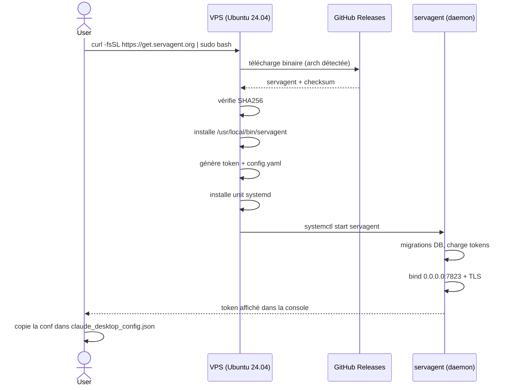
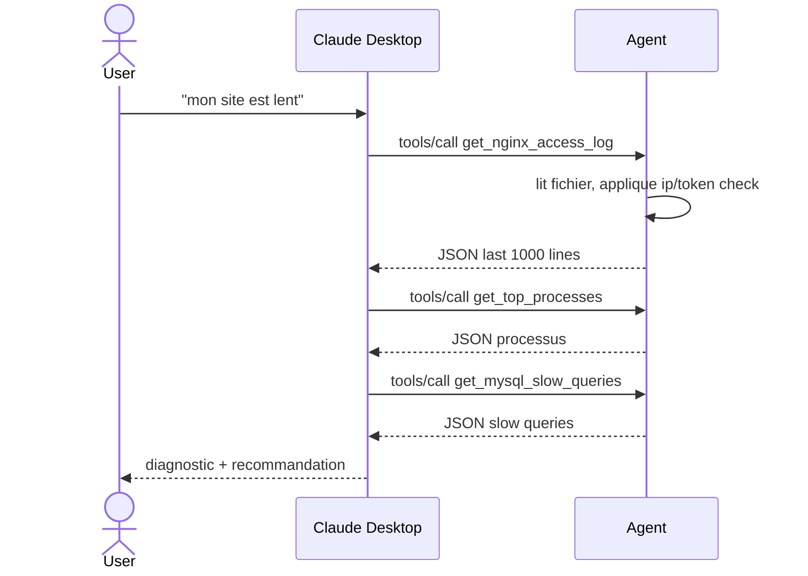
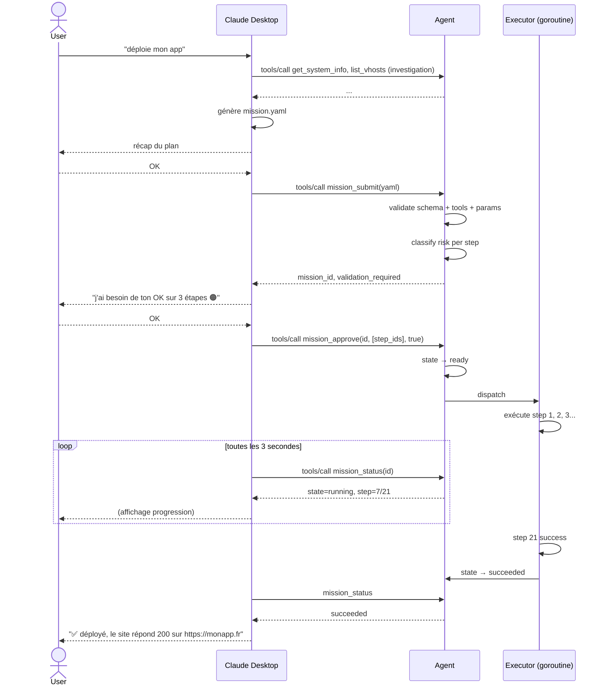
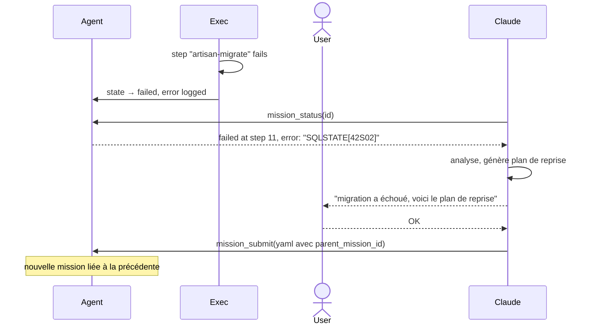

# Servagent — Design Document

> **Version** : v0.1 — 20 avril 2026
> **Statut** : brouillon, en discussion
> **Relation au brief** : ce document complète `docs/brief.md`. Le brief définit le *quoi* et le *pourquoi* ; ce design doc définit le *comment* au niveau code.

## 1. Objet et lecteurs

Ce document décrit l'architecture interne de Servagent : structure du code Go, protocole d'interaction client/agent, modèle de données, sémantique du runtime d'exécution, flows critiques.

Lecteurs visés :
- Le porteur du projet, pour structurer l'implémentation des Phases 1 à 4.
- Tout contributeur externe ultérieur (dès l'open-sourcing public).
- Une IA d'assistance (Claude Code notamment) sollicitée pour générer du code cohérent avec ces choix.

Hors scope :
- Vision, positionnement, roadmap, risques → `docs/brief.md`.
- Schéma des missions YAML → `schemas/mission.schema.json`.
- Catalogue détaillé des ~55 outils (nom, params, output) → `docs/tools/` (à produire).
- Script d'installation → `docs/install.md` (à produire).

## 2. Rappel architectural

Deux processus distincts, jamais fusionnés :

- **Le client** (Claude Desktop du dev, abonnement Pro/Max). Porte le LLM, planifie, génère le YAML, présente les plans à l'utilisateur, transmet les validations. Vit sur la machine du dev.
- **L'agent** (daemon Go sur le VPS). Expose un serveur MCP. Ne contient pas de LLM. Exécute des plans déterministes. Écrit un état local SQLite. Produit un audit log immuable.

Le canal entre les deux : JSON-RPC 2.0 (protocole MCP) sur HTTPS, authentification par bearer token, IP whitelist au niveau transport.

## 3. Structure du projet Go

### 3.1 Arborescence

```
servagent/
├── cmd/
│   ├── servagent/              # binaire principal (daemon)
│   │   └── main.go
│   └── servagentctl/           # CLI local d'administration (optionnel MVP)
│       └── main.go
├── internal/
│   ├── mcp/                    # serveur MCP (JSON-RPC 2.0 sur HTTPS)
│   │   ├── server.go
│   │   ├── transport.go        # HTTP(S) + streamable HTTP
│   │   ├── auth.go             # bearer token + IP whitelist
│   │   └── handler.go          # dispatch vers tools/ ou missions/
│   ├── tools/                  # registre d'outils atomiques
│   │   ├── registry.go         # Tool interface + init registry
│   │   ├── riskctx.go          # définitions RiskLevel + modes de confiance
│   │   ├── observation/        # 🟢 get_system_info, list_processes, etc.
│   │   ├── webserver/          # nginx/apache
│   │   ├── database/           # mysql/postgres
│   │   ├── tls/                # certbot / let's encrypt
│   │   ├── packages/           # apt
│   │   ├── docker/
│   │   ├── git/
│   │   ├── cron/
│   │   ├── firewall/           # ufw
│   │   ├── backup/
│   │   ├── files/              # write, delete, chmod, chown
│   │   └── notify/             # webhooks, email
│   ├── runtime/                # exécution des missions
│   │   ├── executor.go         # boucle principale
│   │   ├── resolver.go         # depends_on, topologie, skip logic
│   │   ├── interpolate.go      # ${var.path} dans les params
│   │   ├── retry.go            # politique de retry
│   │   └── lifecycle.go        # transitions d'état d'une mission
│   ├── store/                  # persistence SQLite
│   │   ├── sqlite.go           # ouverture, migrations
│   │   ├── missions.go
│   │   ├── steps.go
│   │   ├── executions.go
│   │   ├── audit.go
│   │   └── tokens.go
│   ├── audit/                  # audit log (SQLite + fichier append-only)
│   │   └── writer.go
│   ├── config/                 # chargement /etc/servagent/config.yaml
│   │   └── config.go
│   └── version/
│       └── version.go          # injecté au build via -ldflags
├── schemas/
│   ├── mission.schema.json     # schéma des missions (existe déjà)
│   └── tools/                  # schémas des params de chaque outil
│       ├── create_database.schema.json
│       └── ...
├── scripts/
│   └── install.sh              # script d'installation one-liner
├── systemd/
│   └── servagent.service
├── migrations/                 # migrations SQL SQLite (numérotées)
│   ├── 001_init.sql
│   └── ...
├── docs/
│   ├── brief.md
│   ├── design.md               # ← ce document
│   └── adr/                    # Architecture Decision Records
├── test/
│   ├── integration/            # tests d'intégration (VM jetables)
│   └── fixtures/               # missions d'exemple
├── .github/workflows/          # CI
├── go.mod
├── go.sum
├── LICENSE                     # MIT
└── README.md
```

### 3.2 Responsabilités par package

| Package | Responsabilité | Dépend de |
|---|---|---|
| `internal/mcp` | Parler le protocole MCP, authentifier, router les appels | `tools`, `runtime`, `store`, `audit`, `auth` |
| `internal/tools` | Définir et enregistrer les outils atomiques | `store` (pour lire l'état), libs externes (nginx, mysql...) |
| `internal/runtime` | Exécuter un plan validé, gérer les erreurs | `tools`, `store`, `audit` |
| `internal/store` | Persister l'état, faire les requêtes SQL | SQLite driver uniquement |
| `internal/audit` | Écrire l'audit log en double (SQLite + fichier) | `store`, stdlib `log/slog` |
| `internal/config` | Charger et valider la config au démarrage | stdlib YAML |
| `cmd/servagent` | Point d'entrée : parse flags, charge config, démarre serveur MCP + executor | tous les `internal/` |

**Règle de dépendances** : les packages bas niveau (`store`, `config`) ne dépendent jamais des packages haut niveau. Pas de cycles. `internal/mcp` et `internal/runtime` ne se connaissent pas directement (ils communiquent via `store`).

### 3.3 Bibliothèques externes retenues

| Usage | Lib | Pourquoi |
|---|---|---|
| SQLite | `modernc.org/sqlite` | Pure Go, pas de CGO, cross-compile propre |
| JSON Schema | `github.com/santhosh-tekuri/jsonschema/v6` | Draft 2020-12, activement maintenu |
| YAML | `github.com/goccy/go-yaml` | Meilleur que `gopkg.in/yaml.v3` sur les messages d'erreur |
| systemd D-Bus | `github.com/coreos/go-systemd/v22` | Standard de facto |
| Logs | `log/slog` stdlib | Moderne, aucun tiers |
| Routing HTTP | `net/http` stdlib (Go 1.22+) | Le routing par pattern suffit |
| Flag CLI | `flag` stdlib (côté binaire) + `cobra` seulement si `servagentctl` grossit |

Pas de framework lourd (pas de Gin, Echo, Fiber). Stdlib autant que possible.

## 4. Protocole d'interaction (MCP)

### 4.1 Transport

- **JSON-RPC 2.0** sur HTTP POST (transport "Streamable HTTP" du spec MCP).
- **TLS obligatoire**. Pas de mode HTTP clair, même sur localhost.
- Endpoint unique : `POST /mcp`. Chaque requête est une méthode JSON-RPC.
- Un endpoint health : `GET /healthz` (non authentifié, retourne `{"status":"ok"}`). Utile pour monitoring externe.
- Un endpoint version : `GET /version` (non authentifié).

### 4.2 Surface MCP exposée

L'agent expose deux grandes familles, **toutes via des "tools" MCP** (on ne sort pas du protocole).

**Famille A — Outils atomiques** (~55 outils, le catalogue du brief).
Accessibles directement. Utilisés par Claude en mode Investigation (🟢 uniquement, pas de side-effect) et comme briques de missions (tous niveaux).

**Famille B — Outils de contrôle des missions** (une dizaine, réservés au contrôle).

| Tool MCP | Rôle |
|---|---|
| `mission_submit(yaml)` | Soumet un plan. Retourne `mission_id` et la liste des étapes nécessitant validation. |
| `mission_approve(mission_id, step_ids, approved_by_user)` | Approuve un ou plusieurs steps pending. Peut être appelé plusieurs fois. |
| `mission_reject(mission_id, reason)` | Annule une mission avant exécution. |
| `mission_cancel(mission_id)` | Demande l'arrêt d'une mission en cours (laisse l'étape courante se terminer). |
| `mission_status(mission_id)` | Lit l'état courant : state, step courant, progression, erreurs. |
| `mission_logs(mission_id, since_step=null)` | Retourne le log d'exécution détaillé. |
| `mission_list(state?, limit?)` | Liste les missions récentes. |
| `mission_dry_run(yaml)` | Exécute un plan en mode simulation, retourne le rapport sans effets de bord. |

> **Décision structurante.** Tout passe par MCP. Pas d'API REST alternative. Cela simplifie radicalement la config côté Claude Desktop (un seul serveur MCP à déclarer) et concentre la sécurité sur un seul canal.

### 4.3 Gestion des opérations longues

Une mission peut durer 15 minutes. Les appels MCP ne doivent pas bloquer autant.

**Modèle** : `mission_submit` retourne immédiatement (après validation syntaxique + enregistrement en DB). L'exécution se fait en goroutine. Claude Desktop poll `mission_status` régulièrement, ou souscrit à un stream si on décide d'implémenter SSE en v0.2.

Pour le MVP : **polling simple**. Claude appelle `mission_status` toutes les 2-5 secondes. Le tool retourne l'état courant et un `cursor` qui permet de ne récupérer que les nouveaux événements.

### 4.4 Format des erreurs

Toute erreur métier retourne un code d'erreur JSON-RPC structuré :

| Code | Signification |
|---|---|
| `-32600` | JSON-RPC invalide |
| `-32601` | Méthode / tool inconnue |
| `-32602` | Paramètres invalides (échec validation schéma) |
| `-32000` | Erreur applicative générique |
| `-32001` | Mission non trouvée |
| `-32002` | Mission dans un état incompatible (ex : approve sur mission déjà running) |
| `-32003` | Outil non autorisé dans le contexte (ex : 🟠 sans validation) |
| `-32004` | Rate limit dépassé |
| `-32005` | Authentification échouée |
| `-32006` | Fichier hors zone whitelistée |

### 4.5 Versionning

Le champ `schema_version: 1` de la mission permet à l'agent de rejeter les plans générés contre un schéma futur qu'il ne connaît pas encore. Le binaire agent expose sa propre `server_info.version` lors du handshake MCP `initialize`.

## 5. Registre d'outils

### 5.1 Interface Go

Chaque outil implémente :

```go
type Tool interface {
    // Identité
    Name() string                     // snake_case, unique
    Category() string                 // "observation", "database", etc.
    Description() string              // pour Claude (MCP tool description)
    RiskLevel() RiskLevel             // Safe, SemiReversible, PoorlyReversible, Destructive

    // Validation
    ParamsSchema() json.RawMessage    // JSON Schema draft 2020-12
    OutputSchema() json.RawMessage    // JSON Schema (pour doc et Claude)

    // Exécution
    Execute(ctx context.Context, params map[string]any) (any, error)
    DryRun(ctx context.Context, params map[string]any) (any, error)
}
```

```go
type RiskLevel int

const (
    RiskSafe              RiskLevel = iota // 🟢 read-only ou actions triviales
    RiskSemiReversible                     // 🟡 modifiant mais réversible
    RiskPoorlyReversible                   // 🟠 difficile à annuler
    RiskDestructive                        // 🔴 irréversible ou critique
)
```

### 5.2 Enregistrement

Chaque package d'outils enregistre les siens via `init()` :

```go
// internal/tools/database/create_database.go
func init() {
    tools.Register(&CreateDatabaseTool{})
}
```

Le registre est global mais populé au démarrage avant le service MCP. Pas de hot-reload au MVP.

### 5.3 Risque : source unique de vérité

Le `RiskLevel()` d'un outil est **la seule autorité**. Le runtime lit cette valeur au moment de classer une étape, quelle que soit la présence ou l'absence de métadonnées dans le plan. Si Claude génère par erreur un champ `risk:` dans le YAML, il est ignoré (le schéma actuel ne l'accepte même pas).

Pour exposer le niveau à Claude côté MCP : la `description` du tool MCP inclut une marque `[RISK: 🟡]` en suffixe, que Claude sait parser. C'est le seul canal d'information.

### 5.4 Séparation Execute / DryRun

Pour le MVP :
- Tools 🟢 : `DryRun == Execute` (aucun effet de bord à simuler).
- Tools 🟡🟠🔴 : `DryRun` retourne une description structurée de ce qui serait fait, sans rien écrire.

Exemple pour `create_database` :
```json
{
  "simulated": true,
  "would_execute": "CREATE DATABASE monapp_prod CHARACTER SET utf8mb4 COLLATE utf8mb4_unicode_ci",
  "would_affect": ["mysql global state"]
}
```

## 6. Cycle de vie d'une mission

### 6.1 États

```
                submit
pending_validation ───approve all─→ ready ──start──→ running ─┬─ succeeded
       │                             │                        ├─ failed
       │                             │                        ├─ aborted
       │                             │                        └─ paused (v0.2: escalate)
       │                             │                           │
       │                             └─cancel──→ aborted          └─resume_plan──→ (new mission with parent_id)
       │
       └──reject──→ rejected
```

### 6.2 Définitions

| État | Signification |
|---|---|
| `pending_validation` | Mission soumise, une ou plusieurs étapes 🟠/🔴 exigent validation utilisateur. En attente de `mission_approve` ou `mission_reject`. |
| `ready` | Toutes les validations nécessaires sont obtenues. Mission en file d'exécution. |
| `running` | Mission en cours. L'executor est en train de parcourir les steps. |
| `paused` | (v0.2+) Mission interrompue suite à `on_error: escalate`. Attend un plan de reprise du client. |
| `succeeded` | Toutes les étapes non-skipées ont réussi. |
| `failed` | Une étape `on_error: abort` a échoué, ou l'escalate n'est pas implémentée. |
| `aborted` | L'utilisateur a explicitement cancel ou rejected. |
| `rejected` | Plan refusé avant exécution. |

### 6.3 Exécution sérielle globale

**Décision structurante.** Une seule mission à la fois par agent. Si une seconde mission est soumise pendant qu'une autre tourne, elle est acceptée et passe en `pending_validation` ou `ready`, mais reste en file. Raisons :
- Éviter les races sur `apt`/`dpkg` lock, configs Nginx, state MySQL.
- Simplifier drastiquement l'executor et la concurrence.
- Un dev solo ne déploie pas deux apps en parallèle la même minute ; la latence est acceptable.

La file est FIFO. Pas de priorité au MVP.

## 7. Flow de validation utilisateur

### 7.1 Calcul des validations requises

À la réception d'un plan (`mission_submit`), l'agent :

1. Valide syntaxiquement contre `mission.schema.json`.
2. Résout chaque `tool:` contre le registre ; erreur si un outil est inconnu.
3. Valide chaque `params` contre le JSON Schema de l'outil concerné.
4. Vérifie que tous les `depends_on` référencent des `id:` existants et placés **plus haut** dans le tableau.
5. Pour chaque étape, récupère `RiskLevel()` via le registre.
6. Détermine, selon le mode de confiance courant (`first_time` / `confident` / `paranoid`), la liste des étapes nécessitant validation.

Règles de validation par mode :

| Risque | `first_time` | `confident` (défaut) | `paranoid` |
|---|---|---|---|
| 🟢 Safe | Auto | Auto | Auto |
| 🟡 SemiReversible | **Validation** | Auto | **Validation** |
| 🟠 PoorlyReversible | **Validation** | **Validation** | **Validation** |
| 🔴 Destructive | **Double validation** | **Double validation** | **Double validation** |

"Double validation" = l'utilisateur doit approuver une première fois, puis l'agent pose une seconde question explicite avant exécution ("Vous confirmez la suppression définitive de la base `prod_backup` ?").

### 7.2 Surface exposée à Claude

La réponse de `mission_submit` :

```json
{
  "mission_id": "deploy-monapp-2026-04-20-abc123",
  "state": "pending_validation",
  "validation_required": [
    {
      "step_id": "drop-old-database",
      "tool": "drop_database",
      "risk": "destructive",
      "requires_double_confirmation": true,
      "display_params": { "name": "legacy_staging" }
    }
  ],
  "auto_approved": [ /* liste des step_ids 🟢🟡 en mode confident */ ]
}
```

Claude présente ces éléments à l'utilisateur, récupère une réponse, et rappelle `mission_approve` ou `mission_reject`.

### 7.3 Expiration

Une mission en `pending_validation` expire après **15 minutes** sans approbation. Elle passe en `rejected` avec la raison `timeout`. Éviter les missions fantômes qui resteraient en attente si l'utilisateur ferme Claude Desktop.

## 8. Executor runtime

### 8.1 Boucle principale

Pour chaque mission en `ready` :

```
1. Transition state → running
2. Pour chaque step dans l'ordre du tableau :
   a. Vérifier depends_on : toutes les deps doivent être "success" (skipped et failed = don't run)
      → si au moins une dep a failed/skipped : step status = "skipped", continue
   b. Interpoler les ${var.path} dans params contre les outputs précédents
   c. Récupérer le Tool du registre
   d. Si mode == dry_run : appeler Tool.DryRun(), loguer, continue
   e. Appeler Tool.Execute() avec timeout_seconds (ou default si absent)
   f. Selon le résultat :
      - Success : enregistrer output (et output_var si défini), continue
      - Failure : appliquer on_error
   g. Écrire audit log + step_execution en DB
3. Transition state → succeeded / failed / aborted selon l'issue
4. Déclencher notifications (webhook / email) si des steps de notif existent
```

### 8.2 Gestion des erreurs

| `on_error` | Comportement |
|---|---|
| `abort` (défaut) | Mission → `failed`. Steps restants → `skipped`. |
| `continue` | Step marqué `failed` mais mission continue. Steps downstream via `depends_on` seront skipped. |
| `retry` | Retry selon la politique. Si après `max_attempts` toujours en échec, fallback implicite à `abort`. |
| `escalate` | (v0.2+) Mission → `paused`. Client notifié via le prochain `mission_status` (snapshot incluant le contexte d'erreur). |

Au MVP, `escalate` se comporte comme `abort` avec un flag dans l'audit : `escalation_requested: true`. Claude voit ça et peut générer un plan de reprise avec `parent_mission_id`.

### 8.3 Interpolation des variables

Syntaxe supportée dans les valeurs string de `params` :
- `${var_name}` — remplace par la valeur scalaire ou objet
- `${var_name.key1.key2}` — chemin dans un objet
- `${var_name[0].key}` — index de tableau

Règles de type :
- Si la string vaut exactement `${foo}` (rien autour) et que `foo` est un objet/nombre/bool, on substitue **le type natif**, pas sa représentation string.
- Si la string contient du texte autour (`"prefix-${foo}-suffix"`), on stringifie toujours.

Scope des variables : mission-wide, référence forward impossible (tu ne peux pas interpoler une variable produite par une étape future). Tentative → erreur claire `-32602`.

Variables réservées, toujours disponibles :
- `${mission_id}`
- `${mission.goal}`
- `${mission.created_at}`

### 8.4 Timeouts

- `timeout_seconds` sur un step : `context.WithTimeout` passé à `Tool.Execute`. À la fin du timeout, le context est cancelé ; les outils doivent respecter ce cancel (c'est une règle pour leurs auteurs).
- Timeout global de mission : **non** au MVP. Une mission peut durer aussi longtemps que la somme de ses timeouts individuels.

### 8.5 Concurrence inter-missions

Garantie simple : `sync.Mutex` au niveau du runtime. Un seul `Execute` actif à la fois. Les appels `mission_submit` restent non-bloquants (enqueue seulement).

## 9. Modèle de données SQLite

### 9.1 Emplacement

`/var/lib/servagent/state.db` avec `journal_mode=WAL` et `synchronous=NORMAL`. Sauvegardé dans le backup journalier par défaut.

### 9.2 Tables

```sql
-- Métadonnées de mission
CREATE TABLE missions (
  mission_id       TEXT PRIMARY KEY,
  parent_id        TEXT REFERENCES missions(mission_id),
  schema_version   INTEGER NOT NULL,
  created_by       TEXT NOT NULL,
  created_at       TEXT NOT NULL,           -- ISO 8601
  goal             TEXT NOT NULL,
  mode             TEXT NOT NULL,           -- execute | dry_run
  context_json     TEXT,                    -- JSON
  state            TEXT NOT NULL,           -- pending_validation | ready | running | ...
  submitted_at     TEXT NOT NULL,
  started_at       TEXT,
  finished_at      TEXT,
  error_message    TEXT,
  raw_yaml         TEXT NOT NULL            -- le plan original pour audit/reprise
);
CREATE INDEX idx_missions_state ON missions(state);
CREATE INDEX idx_missions_created ON missions(created_at DESC);

-- Steps normalisés
CREATE TABLE steps (
  mission_id       TEXT NOT NULL REFERENCES missions(mission_id),
  step_index       INTEGER NOT NULL,
  step_id          TEXT NOT NULL,
  tool             TEXT NOT NULL,
  description      TEXT,
  params_json      TEXT NOT NULL,
  depends_on_json  TEXT,                    -- JSON array
  output_var       TEXT,
  on_error         TEXT NOT NULL,
  retry_json       TEXT,
  timeout_seconds  INTEGER,
  risk_level       TEXT NOT NULL,           -- résolu au submit depuis le registre
  requires_validation INTEGER NOT NULL,     -- 0 / 1
  PRIMARY KEY (mission_id, step_index)
);

-- Exécutions (un step peut avoir plusieurs executions si retry)
CREATE TABLE step_executions (
  id               INTEGER PRIMARY KEY AUTOINCREMENT,
  mission_id       TEXT NOT NULL REFERENCES missions(mission_id),
  step_id          TEXT NOT NULL,
  attempt          INTEGER NOT NULL,
  started_at       TEXT NOT NULL,
  finished_at      TEXT,
  status           TEXT NOT NULL,           -- running | success | failed | skipped | timeout
  output_json      TEXT,
  error_message    TEXT,
  duration_ms      INTEGER
);
CREATE INDEX idx_exec_mission ON step_executions(mission_id, id);

-- Validations utilisateur
CREATE TABLE pending_validations (
  mission_id       TEXT NOT NULL REFERENCES missions(mission_id),
  step_id          TEXT NOT NULL,
  required_confirmations INTEGER NOT NULL,  -- 1 ou 2 (double confirmation pour 🔴)
  obtained_confirmations INTEGER NOT NULL DEFAULT 0,
  resolved_at      TEXT,
  resolution       TEXT,                    -- approved | rejected | timeout
  PRIMARY KEY (mission_id, step_id)
);

-- Audit log append-only
CREATE TABLE audit_log (
  id               INTEGER PRIMARY KEY AUTOINCREMENT,
  timestamp        TEXT NOT NULL,
  actor_token_hash TEXT,                    -- hash SHA-256 du token utilisé
  actor_ip         TEXT,
  action           TEXT NOT NULL,           -- tool.get_system_info | mission.submit | mission.approve | ...
  mission_id       TEXT,
  step_id          TEXT,
  params_json      TEXT,
  result           TEXT NOT NULL,           -- success | failure | denied
  details_json     TEXT
);
CREATE INDEX idx_audit_time ON audit_log(timestamp DESC);
CREATE INDEX idx_audit_mission ON audit_log(mission_id);

-- Tokens d'authentification
CREATE TABLE auth_tokens (
  id               INTEGER PRIMARY KEY AUTOINCREMENT,
  token_hash       TEXT NOT NULL UNIQUE,    -- bcrypt
  label            TEXT NOT NULL,
  created_at       TEXT NOT NULL,
  last_used_at     TEXT,
  revoked_at       TEXT
);
```

### 9.3 Migrations

Fichiers numérotés `migrations/NNN_description.sql`. Table `schema_migrations(version INTEGER, applied_at TEXT)`. Appliquées en ordre au démarrage. Pas de rollback : on ajoute toujours une nouvelle migration.

### 9.4 Rétention

- Missions : conservées 90 jours par défaut (configurable). Après, la ligne de `missions` passe à `archived=1` et les `step_executions` sont compactées.
- Audit log : jamais purgé automatiquement. Rotation du fichier compagnon (`/var/log/servagent/audit.log`) par logrotate, gardé 365 jours.

## 10. Audit log

### 10.1 Double écriture

Chaque événement est écrit :
1. Dans la table `audit_log` (SQLite, WAL).
2. Dans `/var/log/servagent/audit.log` en JSONL append-only, via un handler `slog` dédié.

Raison : défense en profondeur. Si la DB est compromise ou corrompue, le fichier reste. Un outil externe (SIEM, fail2ban) peut tailer le fichier.

### 10.2 Que logge-t-on

**Toujours loggé** :
- Chaque appel MCP (méthode, token hash, IP, code retour).
- Chaque exécution de step (tool, params, résultat).
- Chaque transition d'état de mission.
- Chaque approbation/rejet.
- Chaque échec d'authentification ou rate limit.

**Jamais loggé en clair** :
- Le token bearer (on stocke son hash).
- Les mots de passe générés (ex: password d'un `create_db_user` dont la stratégie est `generate_and_return`). Stockés chiffrés dans `step_executions.output_json`, déchiffrés uniquement à la demande via un endpoint dédié. **À spécifier en détail en v0.2.** Au MVP : stockage en clair mais dans une zone SQLite avec permissions `600`, log écrit mais marqué `[REDACTED]`.

### 10.3 Intégrité

Pas de chaînage cryptographique au MVP (tempting, mais scope creep). Une table `audit_log` append-only par convention (aucune requête DELETE dans `internal/audit`). À envisager en v0.3 : hash chaîné type blockchain pour garantir non-altération.

## 11. Sécurité transport

### 11.1 TLS

Trois modes dans `config.yaml` :

| Mode | Description | Cas d'usage |
|---|---|---|
| `self_signed` | Certificat auto-généré au premier lancement, valide 10 ans | VPS sans domaine, localhost |
| `letsencrypt` | Certificat Let's Encrypt via ACME intégré (standalone ou webroot) | VPS avec domaine dédié |
| `provided` | Certificat fourni par l'utilisateur (paths vers cert + key) | Reverse proxy devant, certificat entreprise |

En mode `self_signed`, Claude Desktop doit ajouter le fingerprint à ses hôtes de confiance (TOFU). Documentation à produire.

### 11.2 Authentification

- **Bearer token** unique à l'installation. Généré par `crypto/rand`, 32 bytes encodés en base64url. Affiché une fois, stocké en bcrypt.
- Plusieurs tokens possibles (pour différents devices ou clients) gérés via `servagentctl tokens add|list|revoke`.
- Vérification à chaque requête : `Authorization: Bearer <token>` → bcrypt compare → DB update `last_used_at`.

### 11.3 IP whitelist

- Liste CIDR dans `config.yaml`.
- Vérifiée avant l'auth (évite de consommer CPU bcrypt sur des scans).
- Vide = refuser tout trafic non localhost (safe default).

### 11.4 Rate limiting

- **Global** : 60 req/minute par token. Token bucket en mémoire (`golang.org/x/time/rate`).
- **Par IP** : 100 req/minute (couvre les cas où plusieurs tokens viennent d'une même IP).
- Dépassement → code `-32004` + header `Retry-After`.

### 11.5 Zones whitelistées (rappel du brief §4.3)

Les outils manipulant des fichiers doivent vérifier que le path cible est dans la whitelist codée en dur (`/var/www/*`, `/etc/nginx/sites-*`, `/var/lib/servagent/*`, `/var/backups/servagent/*`, `/etc/letsencrypt/*` en lecture). Tout path hors zone escalade le risque à 🟠 automatiquement (cf. `internal/tools/files/paths.go` — à concevoir).

## 12. Flows critiques (diagrammes)

### 12.1 Installation initiale



### 12.2 Mode Investigation (read-only)



### 12.3 Mode Mission (plan / validation / exécution)



### 12.4 Échec + plan de reprise



## 13. Configuration

### 13.1 Fichier `/etc/servagent/config.yaml`

```yaml
# Servagent agent configuration
# Permissions: 0600, owned by root

server:
  listen: "0.0.0.0:7823"
  tls:
    mode: letsencrypt           # letsencrypt | self_signed | provided
    domain: mon-vps.example.com # requis si letsencrypt
    email: admin@example.com    # requis si letsencrypt
    # cert_file: /etc/servagent/tls/cert.pem   # requis si provided
    # key_file: /etc/servagent/tls/key.pem

auth:
  ip_whitelist:
    - 203.0.113.42/32
    - 10.0.0.0/8
  rate_limit_per_minute: 60
  rate_limit_per_ip_per_minute: 100

trust:
  mode: first_time              # first_time | confident | paranoid

paths:
  state_db: /var/lib/servagent/state.db
  audit_log: /var/log/servagent/audit.log
  backups_dir: /var/backups/servagent
  tls_dir: /etc/servagent/tls

retention:
  missions_days: 90
  audit_log_days: 365

logging:
  level: info                   # debug | info | warn | error
  format: json                  # json | text

# L'option ci-dessous sera proposée post-MVP
# telemetry:
#   enabled: false
#   endpoint: https://telemetry.servagent.org
```

### 13.2 Variables d'environnement

Toutes les options sont surchargeables par env vars `SERVAGENT_SERVER_LISTEN`, `SERVAGENT_AUTH_RATE_LIMIT_PER_MINUTE`, etc. (pattern standard : préfixe `SERVAGENT_`, underscores pour la hiérarchie).

## 14. Tests

### 14.1 Niveaux

| Niveau | Outils | Scope |
|---|---|---|
| Unitaires | `testing` stdlib | Pure logic : resolver de deps, interpolateur, validateur schéma, runtime sans I/O |
| Intégration | `testing` + containers | Outils qui touchent au système (apt, mysql, nginx) exécutés dans des containers Docker éphémères |
| End-to-end | Scripts shell sur VM jetable | Missions complètes sur Ubuntu 24.04 fresh (VPS Hetzner à la demande) |

### 14.2 Cible de couverture

- MVP : 40% global (100% sur runtime, resolver, interpolateur).
- v1.0 : 70% global.

### 14.3 Golden files pour missions

Chaque exemple de mission dans `test/fixtures/missions/*.yaml` a un `.expected.json` associé : le résultat attendu d'un dry-run. La CI fait tourner le dry-run et compare. Détecte les régressions subtiles.

### 14.4 VM jetables

Script `test/e2e/run.sh` qui :
1. Provisionne une VM Hetzner (API).
2. Installe Servagent via le script d'install.
3. Exécute une série de missions réelles.
4. Snapshot de la VM.
5. Destruction.

Coût contrôlé : ~0,02€ par run. Déclenché manuellement, pas à chaque PR.

## 15. Observabilité

### 15.1 Logs

- stdout : logs opérationnels `slog` (JSON par défaut).
- `/var/log/servagent/audit.log` : audit log append-only.
- `journalctl -u servagent` : via systemd.

### 15.2 Métriques

**Pas de Prometheus endpoint au MVP.** Trop de surface pour peu de valeur à ce stade. En v0.3 si besoin, exposer un `/metrics` non authentifié limité à localhost.

### 15.3 Health check

`GET /healthz` retourne :
```json
{ "status": "ok", "version": "0.1.0", "uptime_seconds": 12345 }
```

## 16. Décisions actées et questions ouvertes

### 16.1 Décisions actées

Les points suivants ont été tranchés en revue de design. Ils sont consignés ici pour traçabilité ; leur implémentation suit les règles énoncées dans les sections concernées.

**D1 — Stockage des secrets générés (MVP).** Les secrets produits par un step (ex. mot de passe généré par `create_db_user` avec `password_strategy: generate_and_return`) sont stockés en clair dans la colonne `step_executions.output_json` de SQLite. La protection repose sur les permissions du fichier DB (`600`, propriétaire root) et sur le fait que l'agent tourne déjà en root — tout attaquant qui lit la DB a déjà un accès équivalent à la machine. Pas de chiffrement au repos au MVP. L'audit log en fichier marque ces champs `[REDACTED]`. À réévaluer en v0.3 quand l'agent migrera vers un user dédié (cf. brief §4.4).

**D2 — Redémarrage de l'agent pendant une mission `running`.** Au démarrage, l'agent scanne la table `missions` : toute mission en état `running` est transitionnée en `failed` avec `error_message = "interrupted_by_restart"`. Raison : l'agent ne peut pas reprendre un script shell ou une commande apt au milieu, et l'état système peut avoir divergé pendant le downtime. Claude voit l'échec via `mission_status`, peut proposer un plan de reprise avec `parent_mission_id`. Les steps déjà terminés (`succeeded`) restent intacts dans le log et sont disponibles comme référence pour la planification de reprise.

**D3 — Tâches récurrentes.** Pas de scheduler interne à l'agent. Pour toute mission à exécuter périodiquement (backups nocturnes, renouvellement de certifs au-delà de ce que certbot fait déjà, nettoyage), l'utilisateur crée un cron système qui invoque `servagentctl mission submit /etc/servagent/missions/<plan>.yaml`. Conséquence pour le MVP : `servagentctl` doit savoir se connecter au MCP local et soumettre un plan — capacité minimale à prévoir dès v0.1. Cela rejoint la question ouverte Q5 ci-dessous sur le scope de `servagentctl`.

### 16.2 Questions ouvertes

Points encore en discussion, à trancher au plus tard au début de la phase concernée.

1. **Support multi-tokens multi-labels**. On peut imaginer plusieurs tokens pour plusieurs devices (desktop + mobile). Quel intérêt au MVP ? Tendance actuelle : un seul token au début, multi-tokens en v0.2.

2. **Compression des outputs**. Certains outils (`git_log`, `mysql_dump` checksums) peuvent retourner des outputs volumineux. Les stocker en clair dans SQLite est OK jusqu'à ~1 MB. Au-delà, compression gzip ? Ou externalisation sur disque avec référence ?

3. **Détection d'incohérences dans le plan**. Au submit, on pourrait détecter des patterns suspects (ex: `rm -rf` dans un `run_script`, `DROP TABLE` injecté dans un param SQL). Oui / Non / v0.2 ?

4. **Le CLI `servagentctl`**. Minimum utile au MVP = gérer les tokens (add/list/revoke), afficher le status, soumettre une mission depuis un fichier YAML (nécessaire pour D3). Au-delà ?

5. **Mission "library"**. Idée : un répertoire `/etc/servagent/missions/` où l'utilisateur peut déposer des plans YAML réutilisables, invoquables par nom (`mission_run_from_library("daily-backup")`). Partiellement couvert par D3 (cron + servagentctl sur fichier) : reste à décider si on ajoute l'invocation par nom logique, ou si on s'en tient au chemin de fichier complet.

## 17. Philosophie d'installation : tout à la demande

Principe fondateur, implicite jusqu'ici et rendu explicite dans cette section : **Servagent n'installe rien d'autre que lui-même**. Toute la stack applicative (webservers, bases de données, runtimes, outils) est posée par des missions, donc de manière explicite, auditée et validée par l'utilisateur.

### 17.1 Ce que l'install pose sur le VPS

Le `curl -fsSL https://get.servagent.org | sudo bash` dépose uniquement :

- `/usr/local/bin/servagent` — le binaire statique (~30 Mo, Go sans CGO).
- `/etc/systemd/system/servagent.service` — le unit systemd.
- `/etc/servagent/config.yaml` — la configuration initiale (permissions `600`).
- `/var/lib/servagent/` — répertoire d'état (SQLite + TLS si self-signed).
- `/var/log/servagent/` — répertoire des logs.
- `/var/backups/servagent/` — répertoire des backups futurs.

Prérequis système posés si absents : `ca-certificates` (indispensable pour ACME/TLS sortant). Tout le reste (`ufw`, outils coreutils, etc.) est supposé présent sur une Ubuntu 24.04 de base — si un outil manque, les missions concernées échoueront proprement avec un message explicite, et Claude ajoutera l'installation requise au plan suivant.

Un VPS avec Servagent installé reste un VPS quasi-nu, juste **pilotable**.

### 17.2 Trois règles absolues

**Règle 1 — Pas de pré-installation spéculative.** Aucun webserver, aucune base de données, aucun runtime applicatif (PHP, Node, Python, Ruby, Go) n'est installé au moment de poser Servagent. Pas de choix implicite (MySQL vs MariaDB, Nginx vs Apache, versions de langage). L'utilisateur décide via des missions, plan par plan.

**Règle 2 — Chaque mission déclare ses dépendances.** Une mission de déploiement Laravel commence par `apt_update`, `install_package [php8.3-fpm, ...]`, `install_package [mysql-server]`, `install_package [nginx, certbot]` avant toute étape métier. Ces étapes sont visibles dans le YAML, passent par le flow de validation normal (🟡 → validation en mode `first_time`), et laissent une trace dans l'audit log.

**Règle 3 — Aucun tool ne présume de la présence d'un logiciel.** C'est la règle qui rend les deux premières robustes. Chaque outil métier (`create_nginx_vhost`, `request_certificate`, `compose_up`, etc.) doit vérifier ses prérequis au début de son `Execute()` et retourner une erreur structurée plutôt que de tenter une installation implicite :

```json
{
  "error_code": "prerequisite_missing",
  "missing": ["nginx"],
  "hint": "ajouter un step 'install_package' avec packages=['nginx'] avant cette étape"
}
```

Pas de `apt install nginx` caché dans `create_nginx_vhost`. Pas de `sudo systemctl enable mysql` implicite dans `create_database`. Tout ce qui modifie le système doit être un step explicite dans le plan.

### 17.3 Conséquences de ce choix

**Avantages** :
- Installation de Servagent en secondes, pas en minutes.
- Empreinte minimale : un VPS "équipé Servagent mais sans app" consomme ~50 Mo de RAM et quelques dizaines de Mo disque.
- Neutralité technologique : l'utilisateur n'est pas verrouillé dans des choix imposés (MySQL vs Postgres, Nginx vs Caddy, etc.).
- Auditabilité maximale : chaque package présent sur le système l'a été parce qu'une mission l'a demandé et que l'utilisateur a validé.
- Pas de daemon inutile exposé (chaque service installé = surface d'attaque supplémentaire).

**Inconvénients assumés** :
- La première mission de déploiement sur un VPS fresh comporte 4-5 étapes d'install qui ne servent qu'au setup. Verbeux mais explicite.
- L'utilisateur voit défiler des validations `apt install X` qui peuvent sembler répétitives — mitigé par le mode `confident` qui les passe en auto après les 2-3 premières semaines.

### 17.4 Missions de préparation (v1.0+)

Pour limiter la verbosité au long cours, la bibliothèque de missions types prévue en Phase 7 inclura des plans de préparation réutilisables :

- `prepare-vps-for-laravel.yaml` — pose PHP, Composer, MySQL, Nginx, Certbot.
- `prepare-vps-for-node.yaml` — pose Node via NVM, Nginx, Certbot.
- `prepare-vps-for-docker.yaml` — pose Docker Engine, Compose plugin, UFW rules.

Ces missions ne sont pas une feature spéciale : ce sont des YAML qui respectent le même schéma que les autres. L'utilisateur les exécute une fois sur un VPS fresh, puis ses missions applicatives suivantes peuvent présumer que la stack de base est là (les tools continuent néanmoins de vérifier leurs prérequis — la règle 3 reste absolue).

### 17.5 Exception : les dépendances transitives d'un paquet

Quand `install_package [nginx]` tourne, `apt` installe aussi automatiquement les dépendances Debian (`nginx-common`, `libnginx-mod-*`, etc.). C'est le comportement natif d'apt et Servagent ne s'y oppose pas. Ces dépendances transitives sont loggées dans le `output_json` du step pour traçabilité mais ne sont pas considérées comme des actions séparées.

---

*Document vivant — révisé au fur et à mesure des décisions d'implémentation.*
